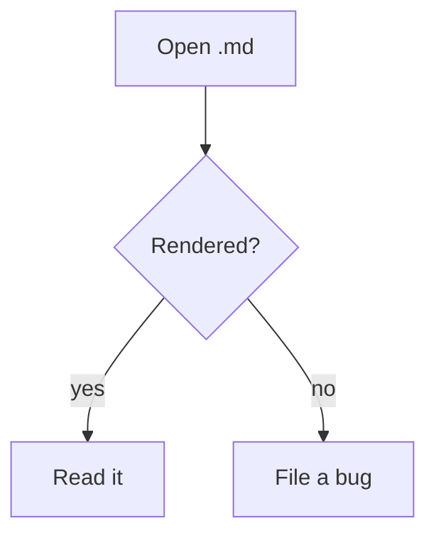

# Marklens sample

A manual smoke test exercising every rendering path.

## Text

**Bold**, *italic*, ~~struck~~, `inline code`, and a [relative link](OTHER.md)
plus an [external link](https://example.com).

## Image (relative, resolves against this folder)


A filename with spaces, which a URL spells `%20` - once in Markdown, once as raw
HTML, the form an `` with a width usually takes:


## Table

| Feature   | Works |
|-----------|:-----:|
| Tables    | ✅ |
| Task list | ✅ |

## Task list

- [x] Render Markdown
- [ ] Take over the world

## Code

```python
def greet(name: str) -> str:
    return f"hello, {name}"
```

## Mermaid



> A viewer, not an editor.
